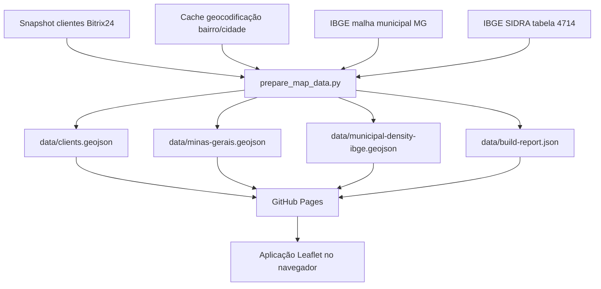

# Arquitetura

## Visão geral

O projeto é uma aplicação web estática publicada em GitHub Pages. Não existe backend próprio em produção. Toda a renderização acontece no navegador, a partir de arquivos estáticos versionados no repositório.

## Stack técnica

- Frontend estático: `HTML`, `CSS`, `JavaScript`
- Mapa: `Leaflet`
- Agrupamento de marcadores: `Leaflet.markercluster`
- Geração de dados: `Python`
- Publicação: `GitHub Pages`

## Componentes principais

- `index.html`
  - estrutura base da página
  - sidebar
  - container do mapa
  - carregamento de assets externos

- `app.js`
  - inicialização do mapa
  - definição e ativação das camadas
  - renderização de marcadores e clusters
  - carregamento lazy da camada de densidade
  - popups, legenda e estatísticas

- `styles.css`
  - layout responsivo
  - identidade visual
  - estilos das camadas, clusters, popups e legenda

- `scripts/prepare_map_data.py`
  - pipeline de preparação dos dados
  - sincronização do snapshot de clientes
  - download de fontes oficiais do IBGE
  - reaproveitamento do cache de geocodificação
  - geração dos GeoJSONs de produção

## Arquivos de dados publicados

- `data/clients.geojson`
  - pontos de clientes para as camadas comerciais

- `data/minas-gerais.geojson`
  - limite estadual de Minas Gerais

- `data/municipal-density-ibge.geojson`
  - polígonos municipais com densidade demográfica oficial

- `data/build-report.json`
  - resumo do último build de dados

## Camadas do mapa

Camadas de clientes:

- `Clientes`
- `Assinatura de Contrato`
- `Licitação - Publicação`
- `Fechamento`

Camada especial:

- `Densidade populacional`

## Fluxo de dados

## Decisões técnicas importantes

- O site é 100% estático para simplificar operação e publicação.
- Os dados são pré-processados em Python para reduzir trabalho no navegador.
- A geocodificação dos clientes usa centro aproximado de bairro/cidade.
- A densidade populacional usa fonte oficial do IBGE, em nível municipal.
- A camada de densidade é carregada apenas quando ativada, para evitar custo inicial desnecessário.

## Limitações conhecidas

- A posição dos clientes não representa geocodificação exata do endereço completo em todos os casos.
- A densidade demográfica oficial disponível foi aplicada por município, não por bairro.
- O arquivo `municipal-density-ibge.geojson` é relativamente pesado, embora já tenha sido simplificado.

## Pontos de extensão mais prováveis

- busca por cliente
- filtro por cidade
- filtro por município
- destaque visual por etapa
- atualização automática do snapshot de clientes a partir do Bitrix24
